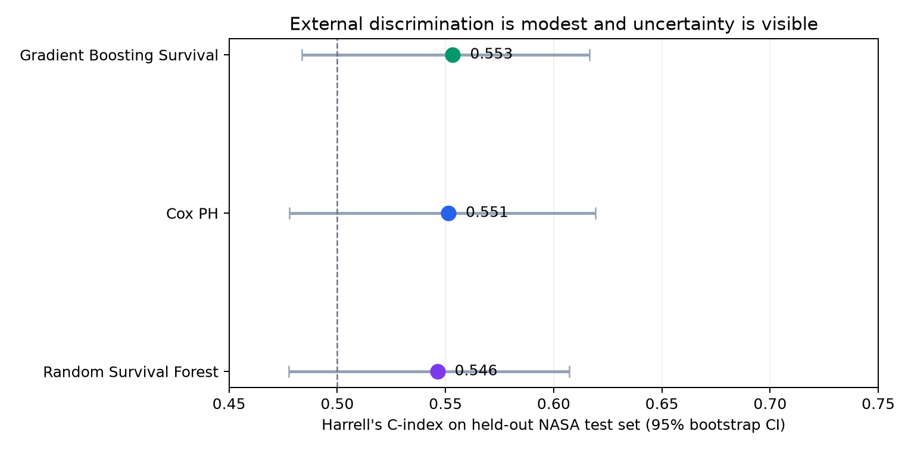
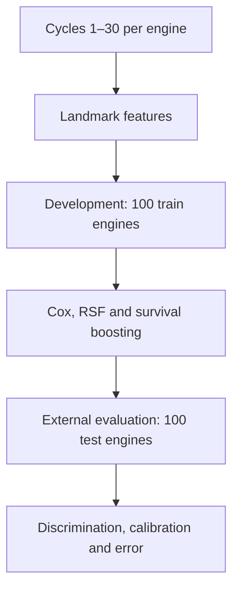
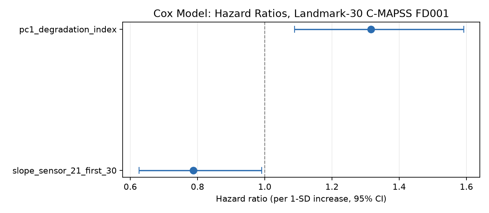
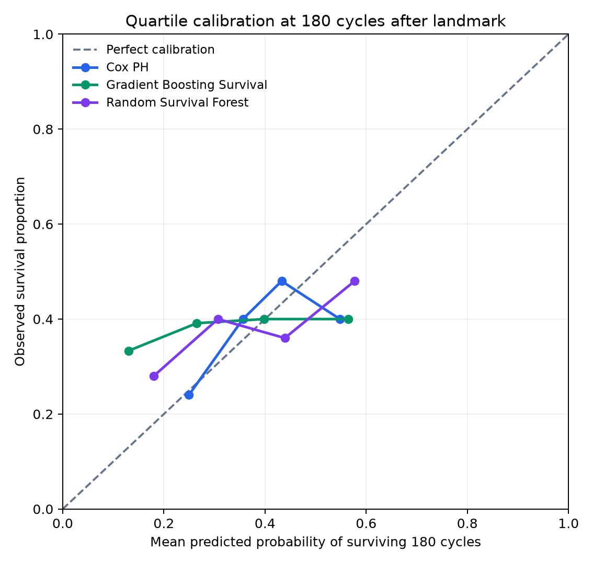

# Predictive Maintenance with Survival Analysis

[](https://github.com/dev-lorenzosartori/probabilistic-survival-analysis/actions/workflows/ci.yml)


An end-to-end survival analysis case study that turns the first 30 operating cycles of an aircraft engine into time-to-failure risk estimates. The project combines transparent statistical reasoning, leakage-safe feature engineering, external validation, and business-oriented model selection.

> **Decision question:** after cycle 30, which engines should maintenance teams prioritize, and how likely is each engine to remain operational at a future planning horizon?

## Executive result

The simplest model was the most defensible choice. On the 100 held-out NASA FD001 test engines, the three models produced similar and modest discrimination, with overlapping uncertainty intervals. The Cox model delivered the best probability accuracy and calibration while retaining direct interpretability.

| Model | Harrell's C (95% bootstrap CI) | Mean time-dependent AUC | Integrated Brier score | Calibration MAE at +180 cycles |
|---|---:|---:|---:|---:|
| Gradient Boosting Survival | **0.553** [0.484, 0.617] | **0.577** | 0.183 | 0.124 |
| Cox proportional hazards | 0.551 [0.478, 0.619] | 0.553 | **0.176** | **0.062** |
| Random Survival Forest | 0.546 [0.478, 0.607] | 0.551 | 0.182 | 0.092 |

Higher is better for C-index and AUC; lower is better for Brier score and calibration error. The results do **not** support a claim that a nonlinear model materially outperforms Cox.



## Business translation

A risk ranking is useful only when it changes a decision. At a selected horizon, a maintenance policy can compare the expected cost of intervening now with the expected cost of waiting:

$$
\operatorname{EC}(\text{wait}\mid x,t)
= \bigl[1-\hat S(t\mid x)\bigr]C_{\text{failure}}
+ \hat S(t\mid x)C_{\text{inspection}}
$$

Intervene when the expected cost of waiting exceeds the preventive-maintenance cost, subject to capacity and safety constraints. In a real fleet, the threshold must be estimated from actual failure costs, intervention effectiveness, lead times, spare-parts availability, and the cost of unnecessary maintenance. FD001 supplies a rigorous modeling benchmark, not those operating economics.

## Analytical design



The **cycle-30 landmark** prevents future information from leaking into the prediction. Only sensor values available during cycles 1–30 are used. Model fitting, scaling, PCA orientation, and all learned parameters use the official training engines exclusively. NASA test-set RUL labels are revealed only after fitting to reconstruct held-out event times.

### Why survival analysis?

Binary classification discards both timing and incomplete follow-up. Survival analysis models the probability of remaining event-free beyond time $t$:

$$
S(t)=P(T>t)
$$

The Kaplan–Meier estimator provides a non-parametric baseline under censoring:

$$
\hat S(t)=\prod_{t_i\le t}\left(1-\frac{d_i}{n_i}\right)
$$

In the landmark cohort, median residual survival was **172 cycles**. Estimated survival at **+200 cycles** was approximately **30.9%**, although the small late-horizon risk set makes that region more uncertain.

## From unstable sensors to a defensible signal

The initial feature set exposed a common failure mode in industrial modeling: many sensors measured nearly the same latent degradation process.

- 25 candidate variables for 100 observed development events: **4 events per variable**.
- Maximum variance inflation factor: **83**.
- Naive Cox Hessian condition number: **2,860**.
- The first principal component of 12 significant early sensor means explained **95.4%** of their variance.

The final feature representation therefore uses one early-degradation component plus an effectively orthogonal sensor-21 trend. The compact Cox model was stable and interpretable:

| Covariate | Hazard ratio per 1 SD | 95% CI | p-value |
|---|---:|---:|---:|
| Early degradation index | 1.32 | [1.09, 1.59] | 0.0046 |
| Sensor-21 early trend | 0.79 | [0.63, 0.99] | 0.0420 |

The proportional-hazards assumption was not rejected for either covariate (Schoenfeld residual tests: $p=0.273$ and $p=0.653$). The sensor-21 effect remains marginal and should not receive a physical interpretation without authoritative sensor metadata.



## External evaluation

All three algorithms receive the same two features so that the comparison isolates model form rather than feature-budget advantage. Hyperparameters were fixed before held-out evaluation; the test set was not used for tuning.

The evaluation reports:

- Harrell's C-index with 1,000 bootstrap resamples;
- cumulative/dynamic AUC at +120, +150, +180, +210, and +240 cycles;
- time-specific and integrated Brier scores;
- quartile calibration at +180 cycles.



## Repository map

| Path | Purpose |
|---|---|
| `src/build_cmapss_survival_table.py` | Converts raw FD001 trajectories into landmark survival tables |
| `src/feature_engineering.py` | Fits leakage-safe scaling and PCA on development data |
| `src/cox_model_cmapss.py` | Fits and diagnoses the interpretable Cox model |
| `src/evaluate_models_cmapss.py` | Runs held-out Cox, RSF, and gradient-boosting evaluation |
| `src/evaluation_utils.py` | Implements explicit survival-metric conventions |
| `tests/` | Data-contract, metric-direction, reference-model, and smoke tests |
| `reports/` | Technical notes, result tables, and publication-ready figures |
| `docs/` | Project charter, dataset plan, landmark decision, and roadmap |

## Reproduce the analysis

Python 3.12 is used in CI.

```bash
python -m venv .venv
source .venv/bin/activate
python -m pip install -r requirements.txt

make test
make synthetic
make km-baseline
make cmapss
make km-cmapss
make cox-cmapss
make evaluate
```

The processed FD001 landmark tables required to rerun the published models are versioned in `data/processed/`. Rebuilding them from source requires the NASA FD001 raw files described in [`data/raw/cmapss/README.md`](data/raw/cmapss/README.md). Serialized model artifacts are intentionally excluded from version control and can be recreated with `make evaluate`.

## Validation safeguards

- Development/test split follows the official NASA partition.
- Feature preprocessing is fitted on development engines only.
- C-index convention is tested explicitly: larger model scores mean earlier failure risk.
- The custom Efron Cox implementation is checked against `lifelines`.
- Data-contract tests verify eligibility, split sizes, event labels, and feature availability.
- GitHub Actions executes the validation suite on every pull request.

## Limitations and next steps

FD001 is a simulated benchmark with one operating condition and one fault mode. Its test labels are fully observed after RUL reconstruction, so this external evaluation is cleaner than most production settings. A deployment study would additionally require temporal or fleet-level validation, censoring-aware calibration on live follow-up, intervention-effect measurement, cost-sensitive thresholding, drift monitoring, and validation across other C-MAPSS subsets or real assets.

## About

Built by [Lorenzo Sartori](https://github.com/dev-lorenzosartori) as a portfolio case in statistical modeling, predictive maintenance, and responsible model evaluation.

Explore the broader portfolio: [Lorenzo Data Portfolio](https://lorenzo-data-portfolio.lorenzosartori34.chatgpt.site)
